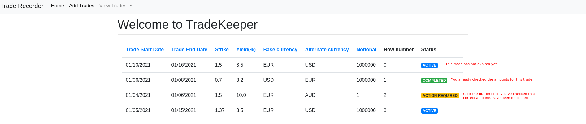
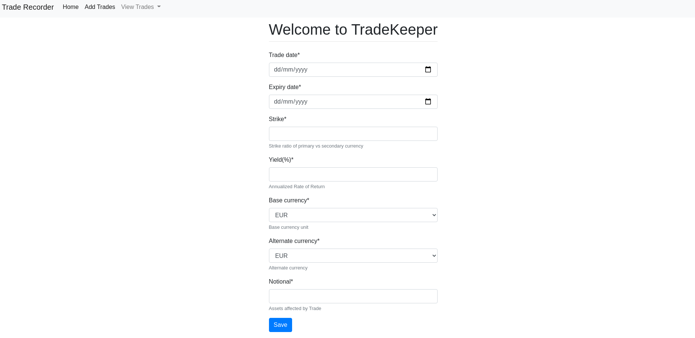

[![Contributors][contributors-shield]][contributors-url]
[![Forks][forks-shield]][forks-url]
[![Stargazers][stars-shield]][stars-url]
[![Issues][issues-shield]][issues-url]
[![LinkedIn][linkedin-shield]][linkedin-url]
[![Email][gmail-shield]][gmail-url]


# Trade Dashboard
A dashboard primarily meant for record-keeping of DCI trades. 

<!-- TABLE OF CONTENTS -->
<details open="open">
  <summary>Table of Contents</summary>
  <ol>
    <li>
      <a href="#about-the-project">About The Project</a>
    </li>
    <li>
      <a href="#getting-started">Getting Started</a>
      <ul>
        <li><a href="#pre-requisites">Prerequisites</a></li>
        <li><a href="#installation">Installation</a></li>
      </ul>
    </li>
    <li><a href="#usage">Usage</a></li>
    <li><a href="#roadmap">Roadmap</a></li>
    <li><a href="#contributing">Contributing</a></li>
    <li><a href="#contact">Contact</a></li>
  </ol>
</details>

<!-- ABOUT THE PROJECT -->
## About The Project
A lot of non financial-services firms these days are trying to perform trades over different asset classes expecting 
capital appreciation. Some trades could involve options, derivatives, structured notes or maybe FX. 
- Most of the firms do not really have an efficient means of record-keeping. 
- Some do spend some efforts for developing book-keeping dashboards, however, this project could potentially save a 
  significant amount of development time, once it is in a good shape. 

This project is a means of creating a framework that can do an independent record-keeping for FX based **Dual currency
investment(DCI)** trades. Learn more about a typical DCI trade [here][dci-trade-url].

## Demo
### View exectuted trades:
Using this dashboard, you can effectively do the bookkeeping for different trades that you perform. 
After you exit a trade, in this when the holding period of DCI expires, you need to check if correct 
amount has been deposited into your accounts. Using this dashboard, you can keep a track
of all your trades by filtering on trade status: 
- You have exited the trade:
  - **Completed**: You have checked that correct amounts have been deposited
  - **Action Required**: Yet to check the amounts
- You have not exited the trade:
  - **Active**: Holding period has not expired yet
  

Note that the buttons corresponding to action required is clickable, however, others are not.
I'm currently working on adding a dialog box to the same.

### Add new trade
You can use the following interface for creating a new trade:
 


## Getting Started

### Pre-requisites
This project only runs on python3. Django should be installed as well.

### Installation
```
git clone https://github.com/jaskirat1208/trade-dashboard
pip install -r requirements.txt

python manage.py makemigrations       // Creating the migrations files
python manage.py migrate              // Updating the databases
python manage.py runserver            // Starts a new server on localhost
```
You can check the application running on localhost:8080

### Usage

## Roadmap

## Contributing

## Contact 
Contact details shared on the top of the page


[contributors-shield]: https://img.shields.io/github/contributors/jaskirat1208/trade-dashboard.svg?style=for-the-badge
[contributors-url]: https://github.com/jaskirat1208/trade-dashboard/graphs/contributors
[forks-shield]: https://img.shields.io/github/forks/jaskirat1208/trade-dashboard.svg?style=for-the-badge
[forks-url]: https://github.com/jaskirat1208/trade-dashboard/network/members
[stars-shield]: https://img.shields.io/github/stars/jaskirat1208/trade-dashboard.svg?style=for-the-badge
[stars-url]: https://github.com/othneildrew/Best-README-Template/stargazers
[issues-shield]: https://img.shields.io/github/issues/jaskirat1208/trade-dashboard.svg?style=for-the-badge
[issues-url]: https://github.com/jaskirat1208/trade-dashboard/issues
[linkedin-shield]: https://img.shields.io/badge/-LinkedIn-black.svg?style=for-the-badge&logo=linkedin&colorB=555
[gmail-shield]:  https://img.shields.io/badge/-Gmail-black.svg?style=for-the-badge&logo=Gmail&colorB=555
[gmail-url]: mailto:jaskiratsingh1208@gmail.com
[linkedin-url]: https://www.linkedin.com/in/jaskirat-singh-1b1344126/
[dci-trade-url]: https://www.maybank2u.com.sg/en/personal/investment/dual-currency-investment.page
